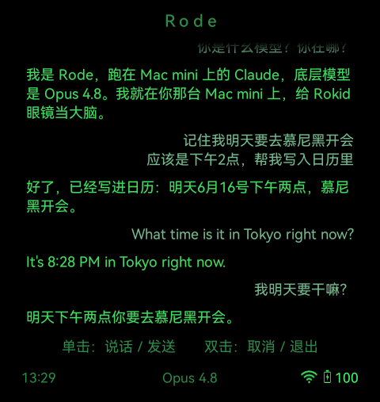

# rode
> [中文](README.md) | **English**

**Rokid AR glasses voice → your own AI brain → glasses HUD.** Single-tap to talk; the glasses record audio and send it to your self-hosted backend, which transcribes it, feeds it to the AI of your choice (Claude by default), and shows the answer on the HUD. Both the brain and the public ingress are pluggable.

<div align="center">
  
  <p><em>Live HUD shots from the glasses (same conversation): self-identification (Claude running on your own machine) · writing to the calendar (agentic execution) · English Q&A (multilingual) · referencing the previous turn (multi-turn context). User on the right, Rode on the left.</em></p>
</div>

---

## ⚠️ For developers · At your own risk (read first)

This is **not** a plug-and-play consumer product. To use rode you need:
- To know how to use **adb** (install the app onto the glasses over a cable)
- An always-on machine + the ability to **expose it to the public internet** (Tailscale, etc.)
- An **AI brain**: Claude by default (requires a subscription or paid API), or swap in any AI agent

**Responsibility and privacy** (you must be aware):
- rode is a **continuous recording device**: what you say is sent to your self-hosted backend and processed by the third-party AI you chose. Use it with discretion when others are present, and comply with local law.
- SETUP **runs scripts on your own machine** and **exposes** local services **to the public internet**. That is a double responsibility surface; assess the risk yourself. This project is provided "AS IS" under Apache-2.0; the author makes no warranty and accepts no liability for any consequences.
- rode depends on **current YodaOS behavior** (sideload, adb, power policy). A Rokid firmware update may break it.

## Architecture

```
glasses app (record) ──multipart audio POST──► your backend (public ingress → :18790)
                                                 │ whisper.cpp STT
                                                 │ Agent.ask()  ← any AI brain (pluggable)
                                     ◄──SSE──────┘ user/status/answer/done/meta
glasses HUD shows text + optionally plays backend-synthesized audio
```

- **Protocol contract** (the only interface between glasses ↔ backend): see [`PROTOCOL.en.md`](PROTOCOL.en.md)
- **Setup** (executable by a human or an AI): see [`SETUP.en.md`](SETUP.en.md)
- Pluggable points: the brain [`backend/agent/types.ts`](backend/agent/types.ts), the public ingress [`backend/expose/types.ts`](backend/expose/types.ts), STT [`backend/stt.ts`](backend/stt.ts)

## v1 scope and limitations

**What it can do**
- Single-tap to talk → STT (whisper, multilingual: mixed Chinese/English/German) → your AI brain → text answer shown on the HUD
- Default brain = Claude, running inside Claude Code: **full agentic** capability on the server — search the web for real-time info, read/write files, run code, call MCP tools, write to the calendar, and more (the screenshot above wrote to the calendar)
- **Multi-turn context**: remembers the previous utterance, and does not lose it across backend restarts (sessionId persisted to disk)
- **Conversation history** stays local on the glasses (the most recent ~50 turns, segmented by time), and is still there after reopening the app
- Accidental taps can be canceled/undone with a double-tap
- **Three pluggable points**: the brain (any AI) · STT engine · public ingress

**Glasses permissions**
| Present and in use | Declared but restricted / not enabled |
|---|---|
| Microphone (record speech) · Network · Wake lock (no sleep within a turn) · Read battery/WiFi signal/time (status bar) · URL+token injected via adb | `CHANGE_WIFI_STATE`: **Android 12 blocks non-system apps from enabling WiFi**, so the rode app itself still can't turn it on (use the official Rokid phone app or adb, see below) · `CAMERA`: declared, but **v1 has no vision** (records audio only; no photos sent; the protocol reserves an image field, glasses-side implementation pending) |

**Current limitations (v1 cannot do)**
- **No on-device TTS**: YodaOS omits the TextToSpeech system service; the Mac mini can run `edge-tts` and stream synthesized MP3 audio back (off by default; see SETUP)
- **No vision**: no photos taken / no images sent (camera permission exists but is not wired up)
- **WiFi cannot stay on automatically**: it gets turned off by YodaOS on battery/sleep; the rode app itself has no permission to re-enable it, but the **official Rokid phone app (Settings → WiFi) can toggle/switch the glasses' WiFi at the system level** — pair it once and you're set (see "Known WiFi limitation" below)
- **Not streaming**: one answer per turn (returned as a whole), not token-by-token streaming output (streaming is on the roadmap)
- **Not always-listening**: turn-based, triggered by a single tap, not actively listening (a power-saving + privacy design choice)
- **Not offline**: all computation happens on your server backend; the glasses only do input and output; unusable when disconnected
- **First-turn cold start**: the default Claude brain may take tens of seconds for the SDK cold start on the first turn, then gets faster after multi-turn `resume`

## Quick start
1. **Glasses-side install**: build the APK from `glasses-app/` and `adb install` (see below).
2. **Backend**: follow [`SETUP.en.md`](SETUP.en.md) (install whisper → generate token → start the backend → expose to the public internet → `scripts/config-glasses.sh` to pair the glasses).
3. Single-tap on the glasses to talk.

## Glasses-side install (build)
```sh
cd glasses-app
cp local.properties.example local.properties   # set sdk.dir to your real Android SDK path (or set ANDROID_HOME); URL/token can stay as placeholders — injected by setup via adb, not baked into the APK
./gradlew assembleDebug
adb install -r app/build/outputs/apk/debug/app-debug.apk
```
The URL+token are not baked in at compile time; they are written at runtime by `scripts/config-glasses.sh` via adb (`ConfigReceiver`→SharedPreferences).

## ⚠️ Known WiFi limitation (read first, or the glasses won't connect to the backend)

**Core problem**: the glasses (YodaOS) automatically turn off WiFi when on **battery power / asleep**, and **third-party apps (including rode) have no permission to turn it back on** — Android 12 blocks `setWifiEnabled()` for non-system apps, and the rode app's call returns false the same way. The glasses' native AI goes online **via Bluetooth to a phone**, not relying on WiFi, so the Rokid platform does not keep WiFi on persistently. **Result**: after the glasses reboot or sit idle for a while, WiFi turns off and the HUD shows "not connected to the backend."

**This is not a bug, it is a platform limitation — but Rokid now ships an official fix.**

1. **First choice: the Rokid phone app** (the official app used to pair the glasses) → **Settings → WiFi** — a system-level provisioning entry that can turn the glasses' WiFi on/off, pick a network, or connect to a new one, unrestricted by the third-party permission wall. With your phone nearby, connectivity is a non-issue.
2. **No-phone fallback: adb** (glasses on USB, or adb-over-WiFi already enabled):
   ```sh
   adb shell svc wifi enable          # turn WiFi on; auto-reconnects to the saved network
   adb shell cmd wifi status          # confirm connected (look for "connected to ...")
   ```
3. **Save the WiFi once** (needed either way): let the glasses remember your network — connect once via the Rokid app, or `adb shell cmd wifi connect-network "<SSID>" wpa2 "<password>"`.
4. **After every glasses reboot** WiFi defaults to off, so re-enable it via either method above.

**A fully phone/adb-free fix**: switch to a low-power **Bluetooth-through-phone** relay form factor (Rokid's official CXR path, see roadmap R1). v1's current state — WiFi direct plus connectivity managed via the official Rokid app — is good enough.

## Security
- Each backend **generates a random token**, kept only in the local `.env` and the glasses prefs; zero secrets in the repo (`scripts/check-no-secrets.sh` scans for them)
- Backend: rate limiting / body limits / log redaction; exposing to the public internet means exposing your local AI capabilities, so run the brain within restricted permissions
- The `ConfigReceiver` used for config injection is exported (required for adb delivery) and only accepts https URLs; another app on the same machine could in theory deliver a forged config, a risk that is acceptable on a personal development device

## Related projects

Several projects already bring AI to smart glasses. rode positions itself as a **Rokid-platform, phone-free, self-hosted pluggable agentic backend**. The table below compares the main approaches by hardware, connection method, and brain form factor:

| Project | Hardware | Connection | Brain |
|---|---|---|---|
| **rode** (this project) | Rokid (full Android / YodaOS) | Glasses-native app, WiFi direct to a self-hosted backend, no phone needed | Self-hosted, pluggable (Claude by default, swap in any agent) |
| [claude-code-g2](https://github.com/sam-siavoshian/claude-code-g2) | Even Realities G2 (display only) | WebView + Bluetooth via the official phone app | Claude, counts against the Max subscription |
| [VisionClaude](https://github.com/mrdulasolutions/visionclaude) | iPhone / Meta Ray-Ban | Phone → local MCP | Claude, vision-focused |
| [RokidAIAssistant](https://github.com/zero2005x/RokidAIAssistant) | Rokid (same hardware) | Glasses ↔ phone Bluetooth | Cloud API (multiple providers, bring your own key), not self-hosted |
| [MentraOS](https://github.com/Mentra-Community/MentraOS) | Vuzix / Even / Mach1 | Vendor OS, self-hosted mini-app | Can connect a local LLM; does not support Rokid |

**Architecture trade-off**: rode v1 takes the "glasses connect to the backend directly over WiFi, no phone" route, which wins on being the least hassle — no extra phone app needed; YodaOS turns off WiFi while idle, re-enabled via the official Rokid phone app (Settings → WiFi) or adb (see "Known WiFi limitation"). The other route is "Bluetooth through a phone companion" (adopted by RokidAIAssistant and others, requiring a dedicated phone app + the Rokid CXR SDK), which achieves a WiFi-free low-power form factor but requires dedicated development — this is rode's roadmap R1, not a ruled-out option.

## Roadmap
- **R1 CXR Bluetooth mobile form factor**: a phone companion acts as a gateway over Bluetooth, removing the need for public ingress + low power + fixes WiFi (Rokid's official form factor)
- **R2 Pairing-code provisioning**: the glasses store only a pairing code, with credentials provisioned by the backend, so no sensitive information is persisted
- **R3 Multi-provider ingress**: cloudflared / ngrok / frp built in
- **R4 Idempotent installer via Docker/Nix**

## License
Apache-2.0. AS IS, at your own risk.
