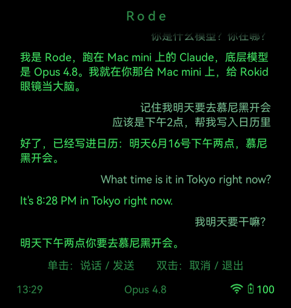

# rode

**Rokid AR 眼镜语音 → 你自己的 AI 大脑 → 眼镜 HUD。** 单击说话，眼镜录音发到你自建的后端，转写、喂给你选的 AI（默认 Claude），回答显示在 HUD 上。大脑和公网入口都可插拔。

<div align="center">
  
  <p><em>眼镜 HUD 实拍（一次对话里）：自报身份（跑在你自己机器上的 Claude）· 把日程写进日历（agentic，真动手）· 英文问答（多语言）· 记住上一轮（多轮上下文）。用户在右、Rode 在左。</em></p>
</div>

---

## ⚠️ 面向开发者 · 自担风险（请先读）

这**不是**普通消费者开箱即用的产品。用 rode 你需要：
- 会用 **adb**（数据线把 app 装进眼镜）
- 一台常开的机器 + 能**公网暴露**它（Tailscale 等）
- 一个 **AI 大脑**：默认 Claude（需订阅或 API 付费），也可换任意 AI agent

**责任与隐私**（务必知情）：
- rode 是**持续录音设备**：你说的话会发到你自建的后端，并经你选的第三方 AI 处理。请在他人在场时审慎使用，遵守当地法律。
- SETUP 会在**你自己的机器上执行脚本**并把本机服务**暴露到公网**。这是双重责任面，自行评估风险。本项目按 Apache-2.0「AS IS」提供，作者不担保、不负责任何后果。
- rode 依赖**当前 YodaOS 行为**（sideload、adb、电源策略）。Rokid 固件更新可能让它失效。

## 架构

```
眼镜 app(录音) ──multipart 音频 POST──► 你的后端(公网入口 → :18790)
                                          │ whisper.cpp STT
                                          │ Agent.ask()  ← 任意 AI 大脑(可插拔)
                              ◄──SSE──────┘ user/status/answer/done/meta
眼镜 HUD 显示文字（v1 无语音朗读）
```

- **协议契约**（眼镜↔后端唯一接口）：见 [`PROTOCOL.md`](PROTOCOL.md)
- **搭建**（人/AI 可执行）：见 [`SETUP.md`](SETUP.md)
- 可插拔点：大脑 [`backend/agent/types.ts`](backend/agent/types.ts)、公网入口 [`backend/expose/types.ts`](backend/expose/types.ts)、STT [`backend/stt.ts`](backend/stt.ts)

## v1 能力范围与限制

**能做什么**
- 单击说话 → STT（whisper，多语言：中/英/德混说）→ 你的 AI 大脑 → 文字答案显示在 HUD
- 默认大脑 = Claude，跑在 Claude Code 里：服务器上**完整 agentic** 能力——联网查实时信息、读写文件、跑代码、调 MCP 工具、写日历等（上图就真把日程写进了日历）
- **多轮上下文**：记得上一句，且跨后端重启不丢（sessionId 落盘）
- **对话历史**留在眼镜本地（最近 ~50 轮，按时间分段），重开 app 仍在
- 误触可双击取消/撤回
- **三处可插拔**：大脑（任意 AI）· STT 引擎 · 公网入口

**眼镜权限**
| 已有且在用 | 声明了但受限 / 未启用 |
|---|---|
| 麦克风（录音说话）· 网络 · 唤醒锁（一轮内不休眠）· 读电量/WiFi信号/时间（状态栏）· 经 adb 注入 URL+token | `CHANGE_WIFI_STATE`：**Android 12 拦截非系统 app 开 WiFi**，实际开不了（靠 adb 兜底，见下）· `CAMERA`：已声明，但 **v1 未接视觉**（只录音、不拍照传图；协议预留图片字段，眼镜端待实现）|

**当前限制（v1 做不到）**
- **无语音朗读**：眼镜缺中文 TTS 语音包 → 答案只在 HUD 显示文字，不出声（朗读=后端合成音频回传，路线图）
- **无视觉**：不拍照/不传图（摄像头权限有但未接）
- **WiFi 不能自动常驻**：电池/休眠被 YodaOS 关、app 无权开 → 靠 adb 兜底或充电时用（详见下「WiFi 已知限制」）
- **非流式**：一轮一答（攒齐再显），不是逐字蹦（流式在路线图）
- **非常听**：单击触发的回合制，不主动监听（省电 + 隐私的设计选择）
- **不离线**：全部计算在你的服务器后端，眼镜只做输入输出；断网即不可用
- **首轮冷启**：默认 Claude 大脑首轮 SDK 冷启可能数十秒，多轮 `resume` 后变快

## 快速开始
1. **眼镜端安装**：从 `glasses-app/` build 出 APK，`adb install`（见下）。
2. **后端**：跟着 [`SETUP.md`](SETUP.md)（装 whisper → 生成 token → 起后端 → 暴露公网 → `scripts/config-glasses.sh` 配对眼镜）。
3. 眼镜单击说话。

## 眼镜端安装（build）
```sh
cd glasses-app
cp local.properties.example local.properties   # 把 sdk.dir 改成真实 Android SDK 路径(或设 ANDROID_HOME)；URL/token 可留占位,由 setup 经 adb 注入,不烤进 APK
./gradlew assembleDebug
adb install -r app/build/outputs/apk/debug/app-debug.apk
```
URL+token 不在编译期烤死，运行时由 `scripts/config-glasses.sh` 经 adb 写入（`ConfigReceiver`→SharedPreferences）。

## ⚠️ WiFi 已知限制（务必先读，否则眼镜连不上后端）

**核心问题**：眼镜（YodaOS）在**电池供电 / 休眠**时会自动关掉 WiFi，而**普通 app 无权重新打开它**——Android 12 拦截非系统 app 的 `setWifiEnabled()`，rode app 试了也返回 false。眼镜原生的 AI 靠**蓝牙连手机**上网、不靠 WiFi，所以 Rokid 没动力让 WiFi 常驻。**结果**：眼镜重启或闲置一阵后 WiFi 就关了，HUD 报「没连上后端」。

**这不是 bug，是平台限制。** 现阶段的现实用法：

1. **先存好 WiFi**：眼镜插 USB，开发者模式下连一次你的 WiFi（`adb shell cmd wifi connect-network "<SSID>" wpa2 "<密码>"`，或在眼镜设置里连一次），让它记住网络。
2. **WiFi 被关了就用 adb 强开**（app 无权，但 adb 可以）：
   ```sh
   adb shell svc wifi enable          # 开 WiFi，自动重连已存网络
   adb shell cmd wifi status          # 确认连上（看到 "connected to ..." 即可）
   ```
3. **充电时更稳**：插着电/在用时 WiFi 不容易被关，回合制语音够用。
4. **每次重启眼镜后** WiFi 默认关，需再 `adb shell svc wifi enable` 一次。

**想彻底解决**：要么让 app 持有 WiFi 控制权（需 Device Owner，得 factory reset，本项目不走），要么走**蓝牙经手机**的低功耗形态（Rokid 官方路线，见路线图 R1）。当前 v1 接受「WiFi 靠 adb 兜底 + 充电时用」的现实。

## 安全
- 每台后端**随机生成 token**，只进本机 `.env` 和眼镜 prefs；仓库零密钥（`scripts/check-no-secrets.sh` 扫描）
- 后端：限流 / body 限制 / 日志脱敏；公网暴露等于暴露本机 AI 能力，请在受限权限内运行大脑
- 配置注入的 `ConfigReceiver` 是 exported（adb 投递所需）+ 仅接受 https URL；同机其它 app 理论上可投假配置，个人 dev 设备风险可接受

## 与相关项目

「把 AI 接进智能眼镜」不是新点子，最近「Claude Code 上眼镜」尤其活跃。rode **不号称首创**——它的位置是 **Rokid + 不经手机 + 自托管 agentic 大脑 + 可插拔**。

| 项目 | 硬件 | 连接 | 大脑 |
|---|---|---|---|
| **rode**（本项目）| Rokid（完整 Android/YodaOS）| 眼镜原生 app，**WiFi 直连**自建后端，**无手机** | 你自己的 agentic 大脑（默认 Claude，可换任意 agent），自托管 |
| [claude-code-g2](https://github.com/sam-siavoshian/claude-code-g2) | Even Realities G2（纯显示）| 经手机**官方 App 的 WebView** + 蓝牙 | Claude，billed to Max |
| [VisionClaude](https://github.com/mrdulasolutions/visionclaude) | iPhone / Meta Ray-Ban | 手机 → 本地 MCP | Claude，视觉为主 |
| [RokidAIAssistant](https://github.com/zero2005x/RokidAIAssistant) | Rokid（同硬件）| 眼镜↔手机蓝牙 | 14 家**云 API**（自带 key），非自托管 agent |
| [MentraOS](https://github.com/Mentra-Community/MentraOS) | Vuzix / Even / Mach1 | 厂商 OS，自托管 mini-app | 可接 local LLM；不支持 Rokid |

**取舍**：Rokid 是完整 Android，所以 rode 能跑原生 app、WiFi 直连、彻底不要手机；代价是眼镜 WiFi 待机会被关、要 adb 兜底（见上「WiFi 已知限制」）。G2 / Meta 那派把连接甩给手机蓝牙、省了 WiFi 麻烦，但绑厂商 App、必须带手机。没有谁更优，看你要哪种。

## 路线图
- **R1 CXR 蓝牙移动形态**：手机 companion 经蓝牙做网关，免公网 + 低功耗 + 解决 WiFi（Rokid 官方形态）
- **R2 配对码下发**：眼镜只存配对码、凭证后端下发，不持久化敏感信息
- **R3 ingress 多 provider**：cloudflared / ngrok / frp 内置
- **R4 Docker/Nix 幂等安装器**

## License
Apache-2.0. AS IS, 自担风险。
